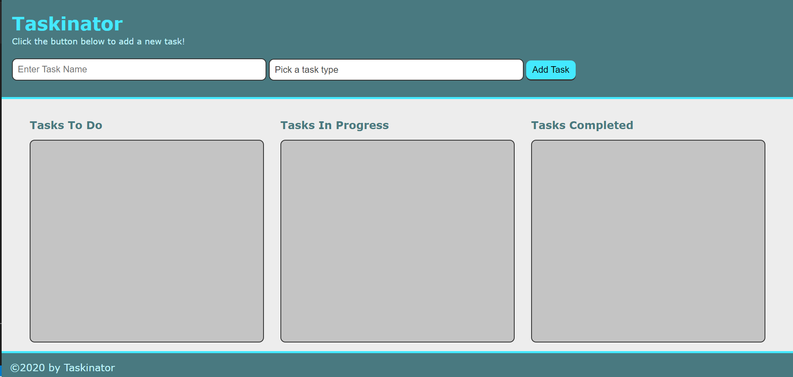
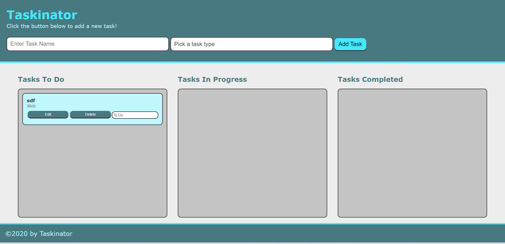
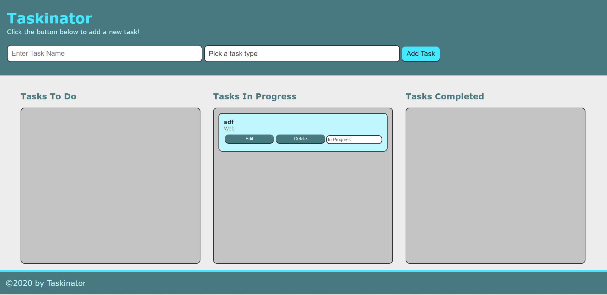

# Taskinator

## Purpose
### A Taskinator will help you set list of your work or of things you want to do, with checking the progress.

1- Will help you set a task and track it.

2- will help you remember where you at on that X task.
 

# looks liks: 
## Face one

## face two

## face three

## Built With
* HTML
* CSS
* JavaScript

# link to the live application

https://jmaouchi.github.io/taskinator/ 

## Contribution
Made by [Jugurta Maouchi]  2022.

### ©️2022 Taskinator, Inc 
